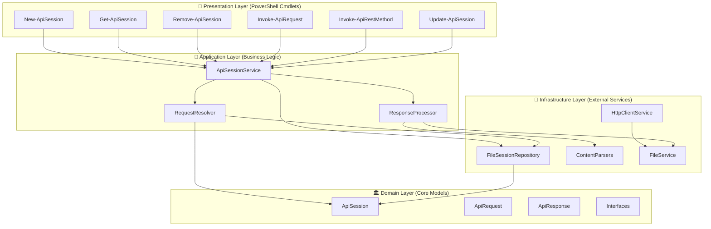

# ApiUtils Architecture Diagram & Build Roadmap

## 🏗️ Clean Architecture Layers



## 📋 Build Roadmap

### Phase 1: Foundation (Start Here) 🏗️

**Goal**: Get basic session storage working

#### Step 1.1: Domain Models
- [ ] Create `ApiSession` class
  - Properties: Name, BaseUri, Headers, AuthToken, AuthScheme, etc.
- [ ] Create basic interfaces: `ISessionRepository`

#### Step 1.2: Basic Session Repository
- [ ] Implement `FileSessionRepository`
  - Save/Load sessions to JSON files
  - Basic CRUD operations
- [ ] Choose storage location (`~/.apiutils/sessions/`)

#### Step 1.3: Simple Session Management Cmdlet
- [ ] Create `New-ApiSession` cmdlet
- [ ] Create `Get-ApiSession` cmdlet
- [ ] Test session persistence

**Milestone**: You can create and retrieve sessions

### Phase 2: HTTP Foundation 🌐

**Goal**: Get basic HTTP requests working without sessions

#### Step 2.1: HTTP Infrastructure
- [ ] Create `HttpClientService`
- [ ] Handle basic authentication (Bearer, Basic)
- [ ] Basic request/response handling

#### Step 2.2: Simple Request Cmdlet
- [ ] Create basic `Invoke-ApiRequest` (no session support yet)
- [ ] Test with various HTTP methods
- [ ] Handle different content types

**Milestone**: You can make HTTP requests independently

### Phase 3: Session Integration 🔗

**Goal**: Connect sessions with HTTP requests

#### Step 3.1: Request Resolution
- [ ] Create `RequestResolver` service
- [ ] Merge session config with request overrides
- [ ] Handle relative vs absolute URLs

#### Step 3.2: Session-Aware Requests
- [ ] Add session support to `Invoke-ApiRequest`
- [ ] Add session support to `Invoke-ApiRestMethod`
- [ ] Test session + override scenarios

**Milestone**: You can use sessions for requests

### Phase 4: Content Handling 📄

**Goal**: Parse responses intelligently

#### Step 4.1: Content Parsers
- [ ] Create `IContentParser` interface
- [ ] Implement `JsonContentParser`
- [ ] Implement `XmlContentParser`
- [ ] Create `CompositeContentParser`

#### Step 4.2: Response Processing
- [ ] Create `ResponseProcessor`
- [ ] Integrate with `Invoke-ApiRestMethod`
- [ ] Handle file output

**Milestone**: Responses are parsed correctly

### Phase 5: Advanced Features ⚡

**Goal**: Polish and advanced functionality

#### Step 5.1: Session Management
- [ ] Create `Remove-ApiSession`
- [ ] Create `Update-ApiSession`
- [ ] Add session validation
- [ ] Session usage tracking

#### Step 5.2: Enhanced Authentication
- [ ] Support multiple auth schemes
- [ ] Credential handling
- [ ] Token refresh (if needed)

#### Step 5.3: Error Handling & Logging
- [ ] Consistent error handling
- [ ] Verbose/Debug output
- [ ] Better validation

**Milestone**: Production-ready module

### Phase 6: Testing & Documentation 📚

#### Step 6.1: Testing
- [ ] Unit tests for core logic
- [ ] Integration tests
- [ ] Pester tests for cmdlets

#### Step 6.2: Documentation
- [ ] Help documentation
- [ ] Usage examples
- [ ] Best practices guide

## 🗂️ Suggested Project Structure

```
LarryWisherMan.ApiUtils/
├── src/
│   ├── Domain/
│   │   ├── Models/
│   │   │   ├── ApiSession.cs
│   │   │   ├── ApiRequest.cs
│   │   │   └── ApiResponse.cs
│   │   └── Interfaces/
│   │       ├── ISessionRepository.cs
│   │       ├── IHttpClientService.cs
│   │       └── IContentParser.cs
│   ├── Infrastructure/
│   │   ├── Repositories/
│   │   │   └── FileSessionRepository.cs
│   │   ├── Services/
│   │   │   ├── HttpClientService.cs
│   │   │   └── FileService.cs
│   │   └── Parsers/
│   │       ├── JsonContentParser.cs
│   │       └── XmlContentParser.cs
│   ├── Application/
│   │   └── Services/
│   │       ├── ApiSessionService.cs
│   │       ├── RequestResolver.cs
│   │       └── ResponseProcessor.cs
│   └── Commands/
│       ├── NewApiSessionCommand.cs
│       ├── GetApiSessionCommand.cs
│       ├── InvokeApiRequestCommand.cs
│       └── InvokeApiRestMethodCommand.cs
├── tests/
└── docs/
```

## 🎯 Key Design Decisions to Make

1. **Session Storage Format**: JSON vs XML vs binary
2. **Session Location**: User profile vs module directory
3. **Authentication Strategy**: How to handle different auth types
4. **URL Resolution**: How to combine base URI + relative paths
5. **Configuration Precedence**: Request params vs session defaults
6. **Error Handling**: Throw exceptions vs return error objects

## 🚀 Quick Start Strategy

**Weekend 1**: Get Phase 1 working (basic session CRUD)
**Weekend 2**: Get Phase 2 working (basic HTTP without sessions)  
**Weekend 3**: Get Phase 3 working (session + HTTP integration)
**Weekend 4**: Polish and Phase 4-6

## 💡 Pro Tips

1. **Start Simple**: Don't over-engineer early - get something working first
2. **Test Early**: Create test scenarios for each phase
3. **Incremental**: Each phase should build working functionality
4. **Focus**: One layer at a time, don't jump around
5. **Real Usage**: Test with actual APIs you use regularly

This approach lets you build incrementally, test each piece, and have a working module at each milestone!